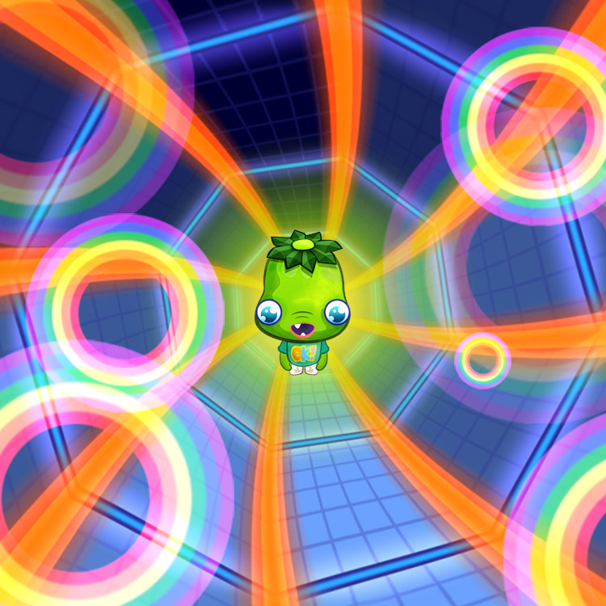

# Swiftshader Image transparency bug

This issue demonstrates a bug I'm seeing when rendering WebGL with [Swiftshader](https://github.com/google/swiftshader/) in headless mode.

## Steps to reproduce

On Linux (Tested on Cent OS 7) run these two commands 

* `node screenshot.js --headless=true` 
* `xvfb-run --server-args='-screen 0 1500x1500x16' node screenshot.js --headless=false`

Looking at headless.png you will see transparent regions:

When you look at xvfb.png you will see the underlying color in the transparent regions.

