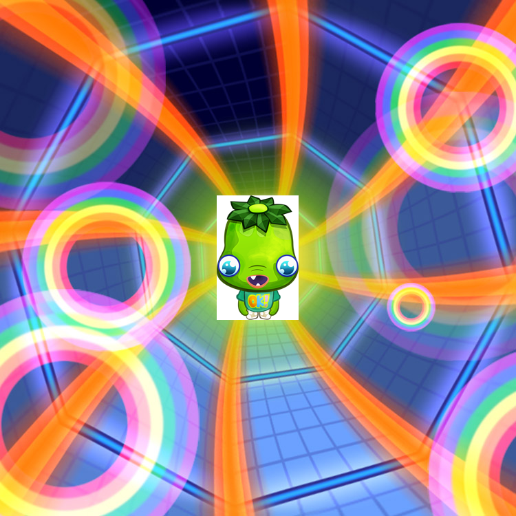

# Swiftshader Image transparency bug

This issue demonstrates a bug I'm seeing when rendering WebGL with [Swiftshader](https://github.com/google/swiftshader/).

## Steps to reproduce

On Linux, run `make` and then open `chrome --no-gpu http://localhost:9000`

## Current behaviour

In the transparent regions of the overlayed image, you see nothing (i.e. transparent).

## Expected behaviour

In the transparent regions of the overlayed image, you see the image behind

_Rendered on Chrome 63_
